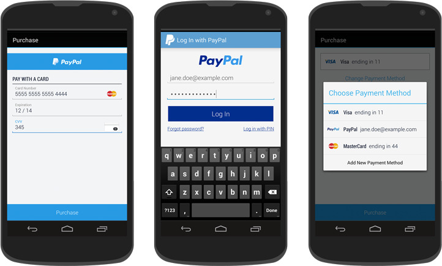

# Braintree v.zero SDK for Android

Welcome to Braintree's v.zero SDK for Android. This library will help you accept card and PayPal payments in your Android app.

## Documentation

Start with [**'Hello, Client!'**](https://developers.braintreepayments.com/android/start/hello-client) for instructions on basic setup and usage.

Next, read the [**full documentation**](https://developers.braintreepayments.com/android/sdk/client) for information about integration options, such as Drop-In UI, PayPal and credit card tokenization.

## Help

* [Read the docs](https://developers.braintreepayments.com/android/sdk/client)
* Find a bug? [Open an issue](https://github.com/braintree/braintree_android/issues)
* Want to contribute? [Check out contributing guidelines](CONTRIBUTING.md) and [submit a pull request](https://help.github.com/articles/creating-a-pull-request).

## Feedback

Braintree v.zero is brand new and in active development. We appreciate the time you take to try it out and welcome your feedback!

Here are a few ways to get in touch:

* [Github Issues](https://github.com/braintree/braintree_android/issues) - For generally applicable issues and feedback
* support@braintreepayments.com - for personal support at any phase of integration
* [877.511.5036](tel:+18775115036) - for personal support in real time (Real people answer our phones!)

### License

The Braintree v.zero SDK is open source and available under the MIT license. See the [LICENSE](LICENSE) file for more info.
