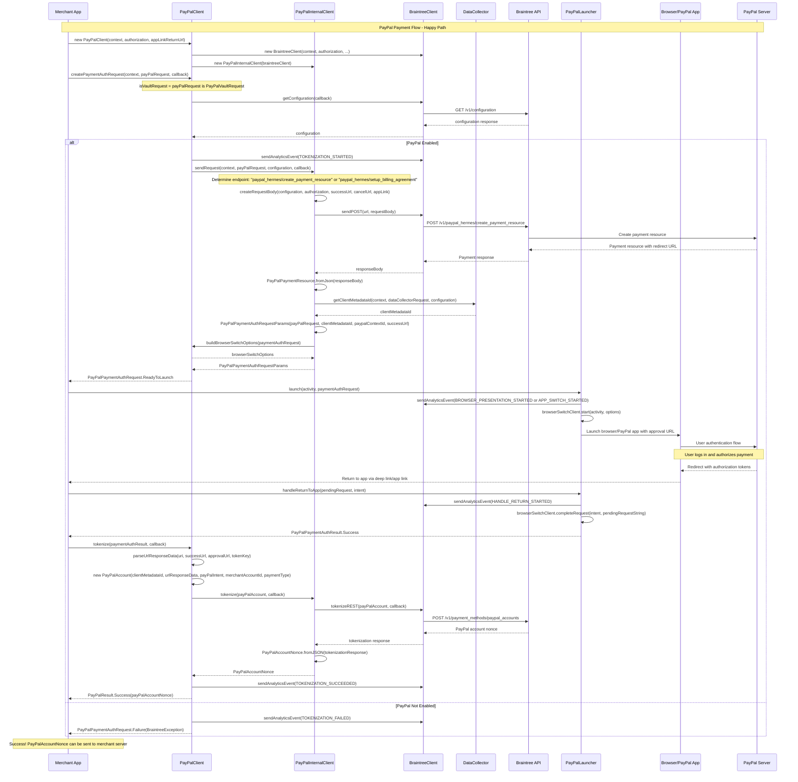

# PayPal Module Happy Path Sequence Diagram

## Flow Description

### 1. Initialization
- Merchant app creates a `PayPalClient` with context, authorization, and return URL
- `PayPalClient` internally creates `BraintreeClient` and `PayPalInternalClient`

### 2. Payment Request Creation
- App calls `createPaymentAuthRequest()` with a `PayPalRequest` (either `PayPalCheckoutRequest` or `PayPalVaultRequest`)
- Client fetches configuration from Braintree API to validate PayPal is enabled
- Analytics event `TOKENIZATION_STARTED` is sent

### 3. Payment Resource Creation
- `PayPalInternalClient` determines the appropriate endpoint based on request type:
  - Checkout: `/v1/paypal_hermes/create_payment_resource`
  - Vault: `/v1/paypal_hermes/setup_billing_agreement`
- Request body is created with payment details, return URLs, and configuration
- API call is made to create the PayPal payment resource

### 4. Data Collection & Request Preparation
- Payment resource response contains redirect URL for PayPal authentication
- `DataCollector` generates `clientMetadataId` for fraud prevention
- `PayPalPaymentAuthRequestParams` is created with all necessary data
- Browser switch options are configured for the authentication flow

### 5. Browser Authentication Flow
- `PayPalLauncher` launches browser or PayPal app with approval URL
- User authenticates with PayPal and authorizes the payment
- PayPal redirects back to the app with authorization tokens

### 6. Return Handling & Tokenization
- App handles the return intent in `handleReturnToApp()`
- URL response data is parsed and validated
- `PayPalAccount` object is created with authorization data
- Final tokenization call creates a `PayPalAccountNonce`
- Success analytics event is sent

### 7. Result
- App receives `PayPalResult.Success` with the `PayPalAccountNonce`
- The nonce can be sent to the merchant server for payment processing

## Key Components

- **PayPalClient**: Main entry point for PayPal integration
- **PayPalInternalClient**: Handles API communication and data collection
- **PayPalLauncher**: Manages browser switching and authentication flow
- **PayPalRequest**: Base class for checkout and vault requests
- **PayPalAccountNonce**: Final tokenized result containing payment method information

## Error Handling

The diagram shows the happy path, but the implementation includes comprehensive error handling for:
- Configuration errors (PayPal not enabled)
- Network failures
- User cancellation
- Invalid authentication responses
- Tokenization failures

Each error case triggers appropriate analytics events and returns failure results to the merchant app.